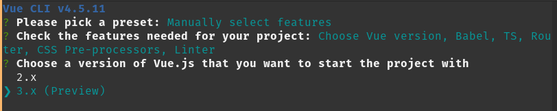

# Documentation pour créer un projet avec Vuejs 3/CLI

Dans un premier temps il faut vous assurez que vous avez bien VUE CLI,  
ouvré un terminal dans le quel vous tapez la commande suivante:  
vue --version

Si vous l'avez la version s'affichera.  
Si vous ne l'avez pas, pour l'installer il vous faudra, toujours dans le terminal,  
de taper la commande suivante :  
npm i -g @vue/cli

Une fois cette étape terminer placer vous dans le dossier où vous voulez créer votre projet vue,  
avec la commande suivante :  
cd le/chemin/vers/votre/dossier

Et taper la commande suivante :  
vue create le-nom-du-projet

Vous allez tombé sur plusieurs manipulation a faire,  
tous d'abord aller sur :

- Manually select features, comme si dessous et appuyé sur la touche entrée.

- En suite vous avez le check the feature vous devez sélectionner a l'aide de la touche espace et des flèches monter/descendre, comme indiquer si dessous.

Pour valider appuyé sur la touche entrée.

- Vous arrivez sur le choix de la version de vue dans notre cas nous allons sélectionner vue 3.

- Appuyer sur entrée jusqu'à Pick a CSS pour choisir le Sass/SCSS de node.

- Pick a linter le premier choix.
- Pick additionnal lint featues : lint on save.
- Where do you prefer placing config for Babel,ESLint : in package.json

- Et pour finir il vous est demandé si vous voulez conserver cette configuration pour chacun de vos projets. Je vous conseil de sélectionner non (N) au cas où, vous devriez d'autres options ou si il y en a des nouvelles

Une fois que vous avez valider le projet va s'installer,  
il n'y aura pu qu'à coder...
